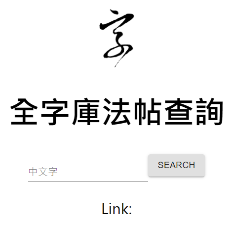

# Chinese-Calligraphy-Database-Crawler
A crawler for Chinese calligraphy database (with a web server)


## Instruction
1. Please execute `crawl.py` or `quick_crawl.py` to crawl the mapping relationship of the word and idx.
```
python3 crawl.py
# or
python3 quick_crawl.py
```
2. Extract valid pairs in the output csv `mapping.csv` to `data.js`.
```
python3 check2js.py
```